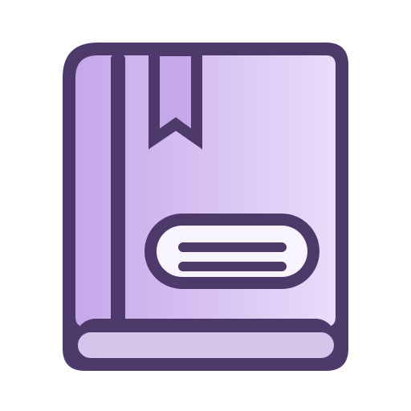
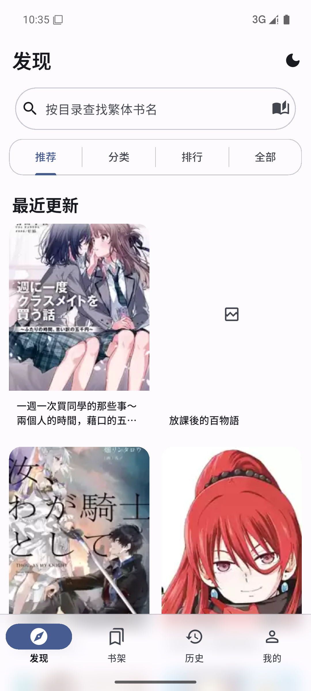
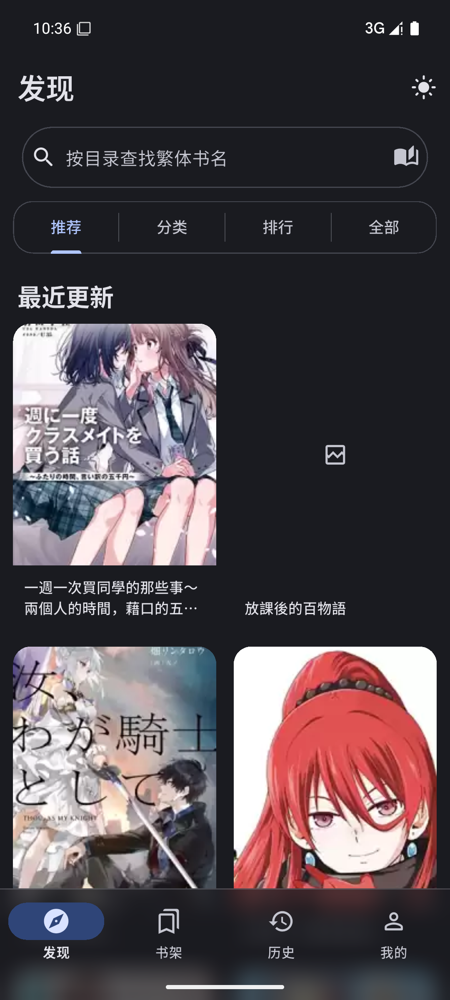
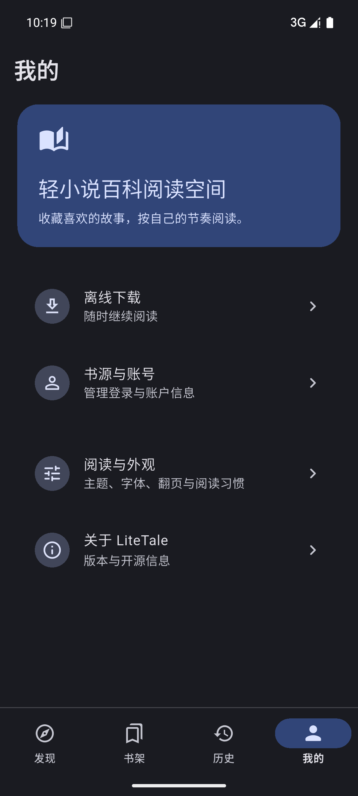

<div align="center">
  
  <h1>LiteTale</h1>
  <p>基于 Wild 的 Material You Android 轻小说阅读器</p>

[](LICENSE)
[](https://github.com/metaMMY07/LiteTale/releases)
[](https://github.com/metaMMY07/LiteTale/releases)
</div>

## Android 0.1.3

**发现页标签分隔更清楚，右上角可快速切换深浅色。** 搜索仍从下方的搜索框进入；仿书翻页默认关闭，可在阅读设置中自行开启。

[下载 ARM64 手机／平板版](https://github.com/metaMMY07/LiteTale/releases/download/v0.1.3/LiteTale-0.1.3-arm64-v8a.apk) · [下载 x86_64 模拟器版](https://github.com/metaMMY07/LiteTale/releases/download/v0.1.3/LiteTale-0.1.3-x86_64.apk) · [更新记录与校验值](docs/releases/0.1.3.md)

APK 使用当前项目的调试证书签名；重新安装或升级时需要保持签名一致。正式渠道分发前应配置专用发布密钥。

### 界面预览

以下图片来自 Android 测试截图，均为竖屏。

<div align="center">
  
  
  
</div>

## 功能

- 一次使用一个书源；可在设置中切换文库8、轻书架或轻小说百科，各自保存登录状态。
- 书架、搜索和阅读历史按书源隔离，保持统一的 LiteTale 界面。
- Material You 动态配色与六种应用图标配色，可切换深浅色主题。
- 支持小说阅读、目录跳转、进度保存、插图阅读与常规翻页；可选仿书翻页仍属实验功能。
- 全屏页面使用左右覆盖转场；底部导航带有毛玻璃背景。

## 构建

项目需要 Flutter、Rust 与 Flutter Rust Bridge 对应的构建环境。Windows 本机构建入口：

```powershell
powershell -ExecutionPolicy Bypass -File tools/build_android.ps1
```

Android 构建和测试说明见 [ANDROID.md](ANDROID.md) 与 [更新记录](CHANGELOG.md)。

## 来源与许可

- 本项目基于 [Wild](https://github.com/niuhuan/wild) 修改，Wild 及其衍生代码按 [GNU GPL v3](LICENSE) 发布。
- Windows 应用图标来自 [celia-sh/Novella](https://github.com/celia-sh/Novella)，按 [GNU AGPL v3](LICENSES/AGPL-3.0.txt) 许可使用。
- 内置霞鹜新致宋 Plus 字体按字体文件声明的 [IPA Font License v1.0](LICENSES/IPA.txt) 使用。
- 详细来源和修改范围见 [THIRD_PARTY_NOTICES.md](THIRD_PARTY_NOTICES.md) 与 [CHANGELOG.md](CHANGELOG.md)。

分发或继续修改本项目时，请保留原作者、上游项目和许可证声明，并按相应许可证提供源代码及字体许可文本。

## 责任声明

1. 本项目仅供学习和研究使用。
2. 本项目不存储小说内容，内容由第三方站点提供。
3. 使用者应自行遵守所在地法律及内容站点的服务条款。
4. 本项目及贡献者不对使用本软件产生的后果承担责任。
