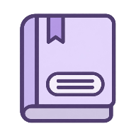

<div align="center">
  
  <h1>LiteTale</h1>
  <p>基于 Wild 的 Material You Android 轻小说阅读器</p>

[](LICENSE)
[](https://github.com/metaMMY07/LiteTale/releases)
[](https://github.com/metaMMY07/LiteTale/releases)
</div>

## Android 正式版 v0.1.15

LiteTale Android 稳定版现已发布。应用以统一的 Material You 界面阅读轻小说，并分别保存各书源的账号与阅读数据。

[下载 ARM64 手机／平板版 APK](https://github.com/metaMMY07/LiteTale/releases/download/v0.1.15/LiteTale-0.1.15-arm64-v8a.apk) · [下载 x86_64 模拟器版 APK](https://github.com/metaMMY07/LiteTale/releases/download/v0.1.15/LiteTale-0.1.15-x86_64.apk) · [查看正式版发布页与校验值](https://github.com/metaMMY07/LiteTale/releases/tag/v0.1.15)

### 功能

- 在文库8、轻书架与轻小说百科之间切换；每个书源的登录状态、书架和阅读记录分别保存。
- 支持书籍搜索、详情、目录与阅读。文库8会复用同站网页登录会话；站点验证与网络策略可能影响个别请求。
- 分别导入全局界面字体和阅读字体，支持 TTF／OTF；加密章节继续使用书源所需字体，避免乱码。
- 提供 Material You 动态配色、深浅色主题和多种应用图标配色。
- 支持平板横屏双页阅读、阅读进度保存和插图查看；仿真翻页可在阅读设置中开关。

APK 使用与既有版本相同的 Android Debug 签名，适合直接安装和从同签名版本升级；目前不用于 Google Play 等商店分发。

## 构建

项目需要 Flutter、Rust 与 Flutter Rust Bridge 对应的构建环境。Windows 本机构建入口：

```powershell
powershell -ExecutionPolicy Bypass -File tools/build_android.ps1
```

Android 构建说明见 [ANDROID.md](ANDROID.md)，版本历史见 [CHANGELOG.md](CHANGELOG.md)。

## 来源与许可

- 本项目基于 [Wild](https://github.com/niuhuan/wild) 修改，Wild 及其衍生代码按 [GNU GPL v3](LICENSE) 发布。
- Windows 应用图标来自 [celia-sh/Novella](https://github.com/celia-sh/Novella)，按 [GNU AGPL v3](LICENSES/AGPL-3.0.txt) 许可使用。
- 内置霞鹜新致宋 Plus 字体按字体文件声明的 [IPA Font License v1.0](LICENSES/IPA.txt) 使用。
- 详细来源和修改范围见 [THIRD_PARTY_NOTICES.md](THIRD_PARTY_NOTICES.md)。

分发或继续修改本项目时，请保留原作者、上游项目和许可证声明，并按相应许可证提供源代码及字体许可文本。

## 责任声明

1. 本项目仅供学习和研究使用。
2. 本项目不存储小说内容，内容由第三方站点提供。
3. 使用者应自行遵守所在地法律及内容站点的服务条款。
4. 本项目及贡献者不对使用本软件产生的后果承担责任。
